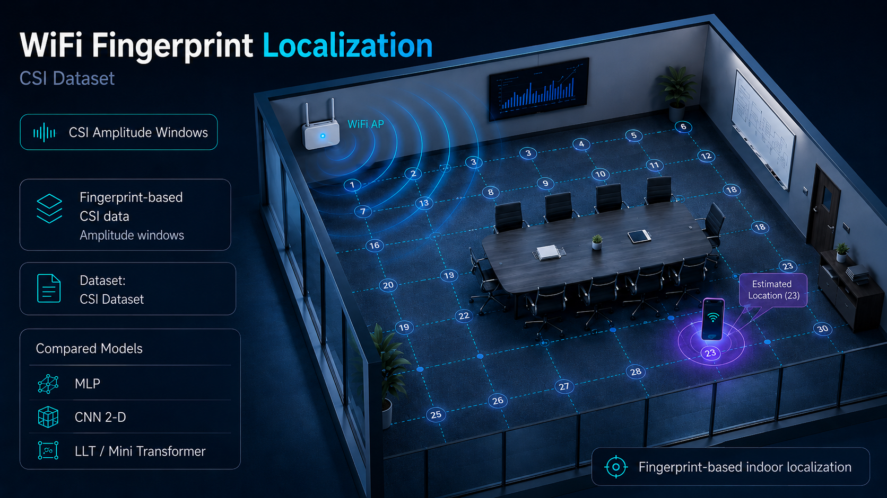

# WiFi Indoor Localization

## Overview

This project aims to investigate the  **indoor localization based WiFi CSI fingerprinting**.  
The sampled CSI windows in the room are used like a radio fingerprint of the ambient, where each room point is mapped to a virtual grid with it's own signal behavior. This signal are learned from different model to match each CSI window to the corresponding position.

The first task developed is a **Reference Points classification** : given a sampled CSI window, the model will predict the corresponding grid point.

## Dataset

The dataset is the public **CSI Dataset for indoor localization**.

## Models compared

The model compered represent three different approaches to the CSI data :

| Model | Idea |
|---|---|
| MLP | Baseline fully-connected on 1D CSI windows  |
| CNN 2-D | Baseline of a 2-D representation of CSI |
| LLT / Mini Transformer | Lightweight model  Transformer, based on patch CSI and self-attention |

